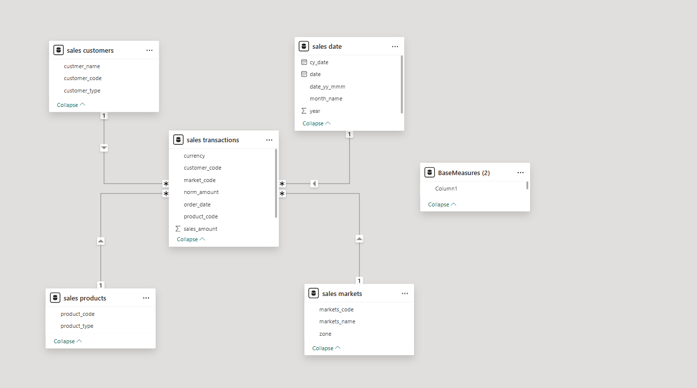
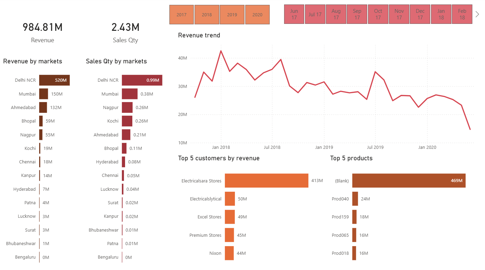
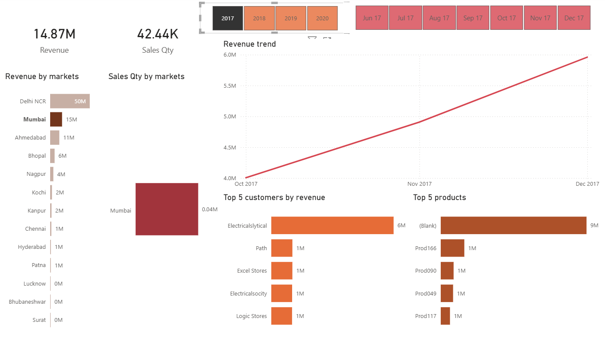
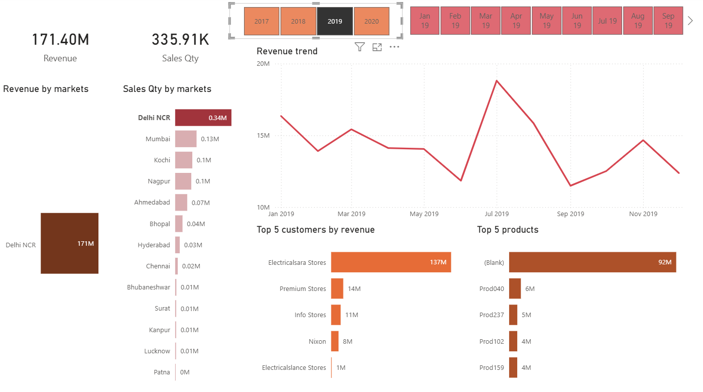
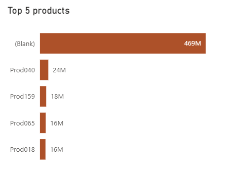

# Power BI Sales Analysis Dashboard

## 📌 Project Overview
This project showcases an interactive Power BI dashboard built to analyze sales performance across markets, customers, products, and time.

Due to Power BI Service licensing limitations, the dashboard is presented using screenshots and highlights key business insights.

---

## 🧠 Business Problem
The business required a centralized reporting solution to:
- Track total revenue and sales quantity
- Monitor revenue trends over multiple years
- Identify top-performing markets, customers, and products
- Support data-driven decision-making

---

## 📊 Key KPIs
- Total Revenue
- Sales Quantity
- Monthly Revenue Trend
- Revenue by Market
- Sales Quantity by Market
- Top 5 Customers by Revenue
- Top 5 Products by Revenue

---

## 🛠 Tools & Skills
- Power BI Desktop
- Power Query (Data Cleaning & Transformation)
- DAX (Measures & Aggregations)
- Data Modeling (Star Schema)
- Data Visualization & Dashboard Design

---

## 🧩 Data Model
The dashboard uses a **star schema** design with a central fact table connected to customer, product, market, and date dimensions.

---

## 📸 Dashboard Screenshots

### Overview Dashboard

### Filtered View – 2017 (Mumbai Market)

### Filtered View – 2019 (Delhi NCR Market)

### Top 5 Customers by Revenue

### Top 5 Products by Revenue

---

## 🔍 Key Insights
- Delhi NCR generates the highest revenue among all markets
- Mumbai and other regions show consistent sales trends over multiple years
- A small number of customers contribute significantly to total revenue
- Certain products dominate revenue contribution
- Seasonal patterns and year-over-year trends can inform business decisions

---

## ℹ️ Notes
- Power BI Service publishing was not used due to licensing limitations
- Blank product values indicate missing product codes in source data
